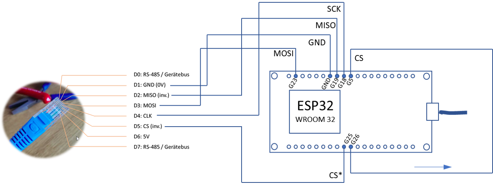

# ESP32_5575
ESP32 software to read Trovis 5575 via Modbus over SPI-slave

# Overview
This sketch periodically reads some Modbus-Registers and -Coils from the Samson Trovis 5575 regulator using it's SPI-bus interface (RJ45 plug on the front). The data is served via an (asynchronous) web server. 

# Installation
Install these libs:

* https://github.com/hideakitai/ESP32SPISlave 
* https://github.com/me-no-dev/ESPAsyncWebServer/
* https://github.com/me-no-dev/AsyncTCP/
* https://github.com/tzapu/WiFiManager/
* ESPAsync_WiFiManager_Lite
* ESP_DoubleResetDetector
* https://github.com/ayushsharma82/AsyncElegantOTA

ESP32-Wiring:

# SPI Slave
We use the SPI Slave Lib from https://github.com/hideakitai/ESP32SPISlave

# WebServer
ESPAsyncWebServer from https://github.com/me-no-dev/ESPAsyncWebServer/ ()

# WiFi Manager
https://github.com/tzapu/WiFiManager/ (MIT-License)

# Over-the-air updates (OTA)
https://github.com/ayushsharma82/AsyncElegantOTA (MIT-License)

